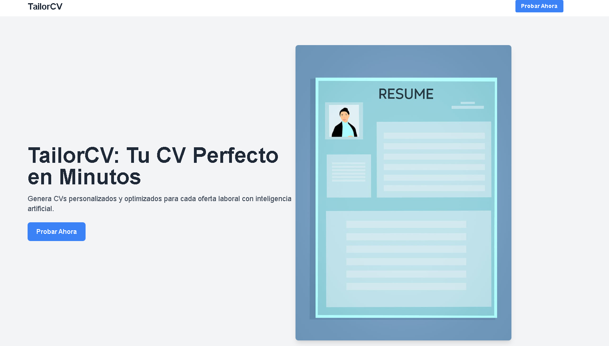
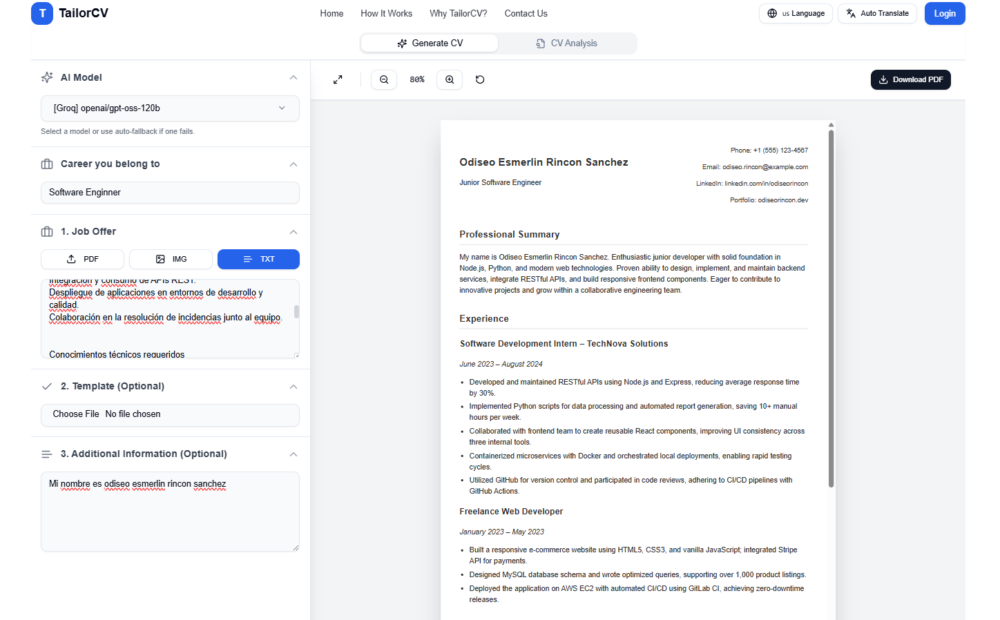
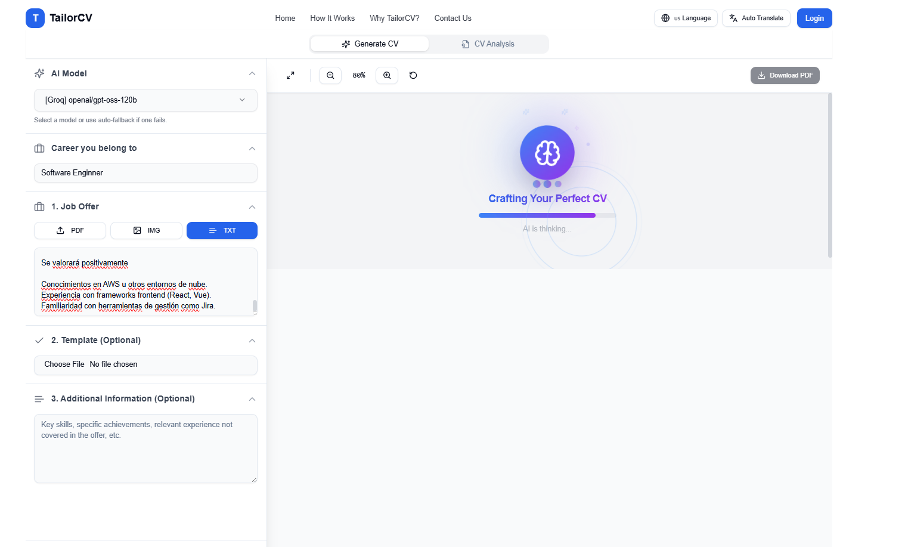
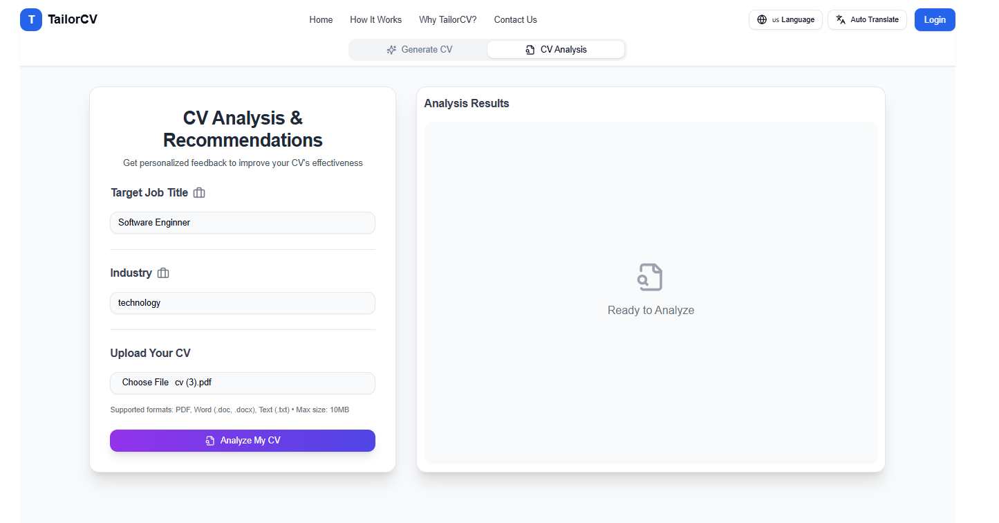
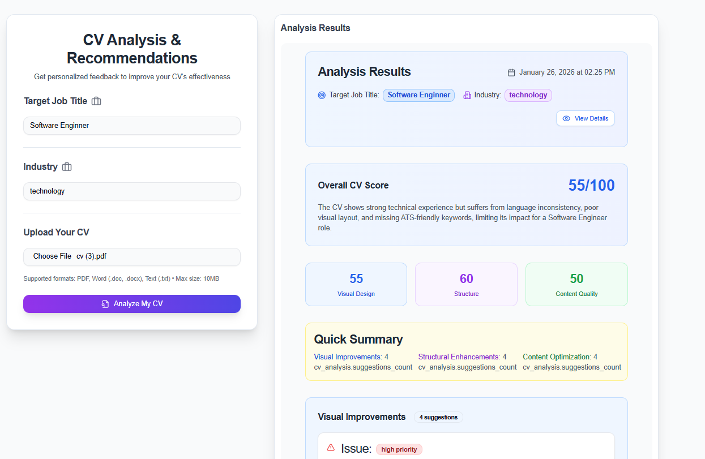

# 📄 **TailorCV** - Generador de CVs Inteligente con IA

**TailorCV** es una aplicación completa que utiliza inteligencia artificial para generar y analizar currículums adaptados automáticamente a cada oferta laboral, optimizando el proceso de postulación.



---

## 🚀 **Características Principales**

### 🎯 **Generador de CV con IA**

Crea currículums personalizados en segundos utilizando múltiples modelos de IA.



**Funcionalidades:**
- **Múltiples formatos de entrada** para ofertas laborales:
  - 📄 PDF
  - 🖼️ Imagen
  - ✍️ Texto
- **Selección de modelo IA** - Elige entre varios proveedores (Groq, OpenRouter) con fallback automático
- **Plantillas personalizadas** - Sube tu propia plantilla en PDF o usa las prediseñadas
- **Campo de carrera/profesión** - Personaliza según tu área profesional
- **Información adicional** - Añade datos extra para enriquecer el CV
- **Vista previa en tiempo real** con controles de zoom (20% - 200%)
- **Modo pantalla completa** para mejor visualización
- **Descarga directa en PDF**
- **Integración con perfil de usuario** - Usa automáticamente tus datos guardados



---

### 🔍 **Análisis de CV con IA**

Obtén un análisis detallado de tu CV existente con puntuaciones y recomendaciones específicas.



**El análisis incluye:**

| Categoría | Descripción |
|-----------|-------------|
| **Puntuación General** | Score global de tu CV (0-100) |
| **Diseño Visual** | Evaluación del formato y presentación |
| **Estructura** | Análisis de la organización del contenido |
| **Calidad del Contenido** | Evaluación del texto y descripciones |

**Funcionalidades adicionales:**
- **Optimización de Keywords** - Detecta palabras clave faltantes y recomienda nuevas
- **Plan de Acción** - Pasos concretos para mejorar tu CV
- **Ejemplos de Mejora** - Muestras de cómo mejorar secciones específicas
- **Recursos Útiles** - Enlaces a herramientas y guías complementarias
- **Formatos soportados**: PDF, DOC, DOCX, TXT



---

### 👤 **Gestión de Perfil**

Mantén tu información profesional organizada y lista para usar.

- **Información Personal** - Datos de contacto y presentación
- **Educación** - Historial académico completo
- **Experiencia Laboral** - Empleos anteriores con descripciones
- **Habilidades** - Skills técnicas y blandas
- **Redes Sociales** - LinkedIn, GitHub, Portfolio, etc.
- **Perfil Profesional** - Resumen ejecutivo personalizable

---

### 🎨 **Galería de Plantillas**

Explora y selecciona entre múltiples diseños profesionales de CV.

- Vista previa de plantillas
- Selección rápida para generación
- Diseños modernos y profesionales

---

### 🌍 **Soporte Multi-idioma**

La aplicación está disponible en varios idiomas:

| Idioma | Código |
|--------|--------|
| 🇪🇸 Español | `es` |
| 🇺🇸 English | `en` |
| 🇫🇷 Français | `fr` |
| 🇨🇳 中文 | `zh` |

---

## 🛠️ **Tecnologías Utilizadas**

| Categoría | Tecnologías |
|-----------|-------------|
| **Frontend** | Next.js 14, React, TypeScript, Tailwind CSS |
| **UI Components** | Shadcn/UI, Radix UI, Framer Motion |
| **Backend** | Next.js API Routes, Prisma ORM |
| **Base de Datos** | PostgreSQL |
| **Autenticación** | NextAuth.js |
| **IA** | Groq, OpenRouter (DeepSeek, Gemini, etc.) |
| **Pagos** | Stripe |
| **PDF** | PDF.js, html-to-pdf |

---

## 💳 **Sistema de Suscripciones con Stripe**

La aplicación incluye un sistema completo de suscripciones.

### Planes Disponibles

| Plan | Características |
|------|-----------------|
| **Básico** | Funciones esenciales |
| **Profesional** | Más generaciones y análisis |
| **Premium** | Acceso ilimitado + features exclusivos |

### Características del Sistema

- ✅ Checkout seguro con Stripe
- ✅ Webhooks para eventos (renovaciones, cancelaciones)
- ✅ Panel de gestión de suscripción
- ✅ Gestión de métodos de pago
- ✅ Historial de facturación

### Configuración

1. Crea una cuenta en [Stripe](https://stripe.com)
2. Obtén tus claves API desde el [Dashboard de Stripe](https://dashboard.stripe.com/apikeys)
3. Configura las variables de entorno en tu archivo `.env`:

```env
STRIPE_SECRET_KEY=sk_test_tu_clave_secreta
NEXT_PUBLIC_STRIPE_PUBLISHABLE_KEY=pk_test_tu_clave_publica
STRIPE_WEBHOOK_SECRET=whsec_tu_secreto_de_webhook
```

4. Para el Webhook de Stripe (desarrollo local):
   ```bash
   npm install -g stripe-cli
   stripe listen --forward-to localhost:3000/api/stripe/webhook
   ```

5. Ejecuta las migraciones:
   ```bash
   npx prisma migrate dev
   npx ts-node prisma/seed-subscriptions.ts
   ```

---

## 🔧 **Instalación y Configuración**

### Requisitos Previos

- Node.js 18+
- PostgreSQL
- Cuenta en Stripe (para pagos)
- API Keys de proveedores de IA (Groq, OpenRouter)

### Pasos de Instalación

```bash
# Clonar el repositorio
git clone https://github.com/tu-usuario/tailor-cv.git

# Instalar dependencias
npm install
# o con bun
bun install

# Configurar variables de entorno
cp .env.example .env
# Editar .env con tus credenciales

# Ejecutar migraciones
npx prisma migrate dev

# Sembrar datos iniciales
npx prisma db seed

# Iniciar en desarrollo
npm run dev
```

### Variables de Entorno Requeridas

```env
# Base de datos
DATABASE_URL="postgresql://..."

# NextAuth
NEXTAUTH_SECRET="tu-secreto"
NEXTAUTH_URL="http://localhost:3000"

# Stripe
STRIPE_SECRET_KEY="sk_..."
NEXT_PUBLIC_STRIPE_PUBLISHABLE_KEY="pk_..."
STRIPE_WEBHOOK_SECRET="whsec_..."

# IA Providers
GROQ_API_KEY="gsk_..."
OPENROUTER_API_KEY="sk-or-..."
```

---

## 📌 **Próximas Funcionalidades**

- [ ] Mejoras en el análisis semántico de ofertas
- [ ] Editor visual de CV en tiempo real
- [ ] Integración con plataformas de empleo (LinkedIn, Indeed)
- [ ] Exportación a múltiples formatos (Word, PNG)
- [ ] Versiones históricas de CVs
- [ ] Compartir CV con link público

---

## 🤝 **Contribuir**

Las contribuciones son bienvenidas. Por favor:

1. Fork el repositorio
2. Crea una rama para tu feature (`git checkout -b feature/AmazingFeature`)
3. Commit tus cambios (`git commit -m 'Add some AmazingFeature'`)
4. Push a la rama (`git push origin feature/AmazingFeature`)
5. Abre un Pull Request

---

## 📄 **Licencia**

Este proyecto está bajo la Licencia MIT. Ver el archivo `LICENSE` para más detalles.

---

## 📢 **Feedback**

¿Tienes ideas o sugerencias? ¡Tu feedback es importante!

- Abre un [Issue](https://github.com/tu-usuario/tailor-cv/issues)
- Contacta por email: tu-email@ejemplo.com

---

**Desarrollado con ❤️ usando Next.js y IA**
