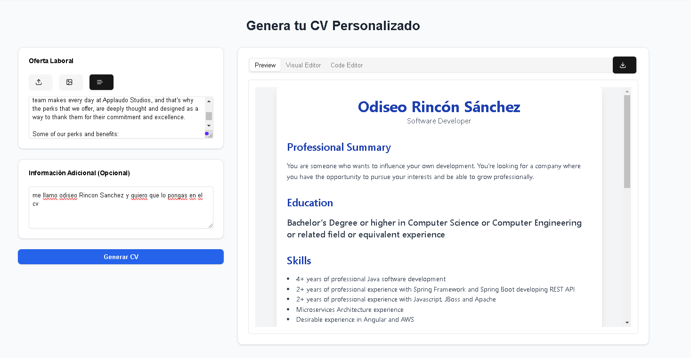

## 📄 **TailorCV** - Generador de CVs Inteligente con IA  

**TailorCV** es una aplicación que utiliza inteligencia artificial para generar **currículums adaptados automáticamente** a cada oferta laboral, optimizando el proceso de postulación.  

### 🚀 **¿Cómo funciona?**  
1️⃣ **Sube una oferta de trabajo** (texto o PDF).  
2️⃣ La IA **extrae la información clave** y la adapta al CV.  
3️⃣ Se genera un **CV optimizado en segundos** en formato PDF.  
4️⃣ El usuario proximamente podra **subir su propia plantilla** para mantener su estilo personal.  

### 🎯 **Objetivo**  
💡 **Ahorrar tiempo y esfuerzo** en la personalización de CVs, eliminando la necesidad de copiar y pegar información manualmente en cada postulación.  

### 🛠️ **Estado del Proyecto**  
Actualmente, **TailorCV** está en fase de desarrollo como un **side project**, y se está recopilando feedback para mejorarlo antes del lanzamiento.  

### 🔧 **Tecnologías Utilizadas**  
- 🧠 **Inteligencia Artificial** para analizar y adaptar CVs,se esta utilizando deepseek y geminis.  
- 🌐 **Next.js / React** para la interfaz de usuario.  
- 📄 **PDF.js** para manejar archivos PDF.  
- ☁️ **Node.js + Express** para el backend.  

### 📌 **Próximas Funcionalidades**  
✅ Mejoras en el análisis semántico de ofertas.  
✅ Mejoras a la hora de descargar pdf.  
✅ Soporte para subir tus propias plantillas y que genere en base a esas plantillas.  
✅ Integración con plataformas de empleo.  

📢 **¡Tu feedback es importante!** Si tienes ideas o sugerencias, no dudes en compartirlas.  

