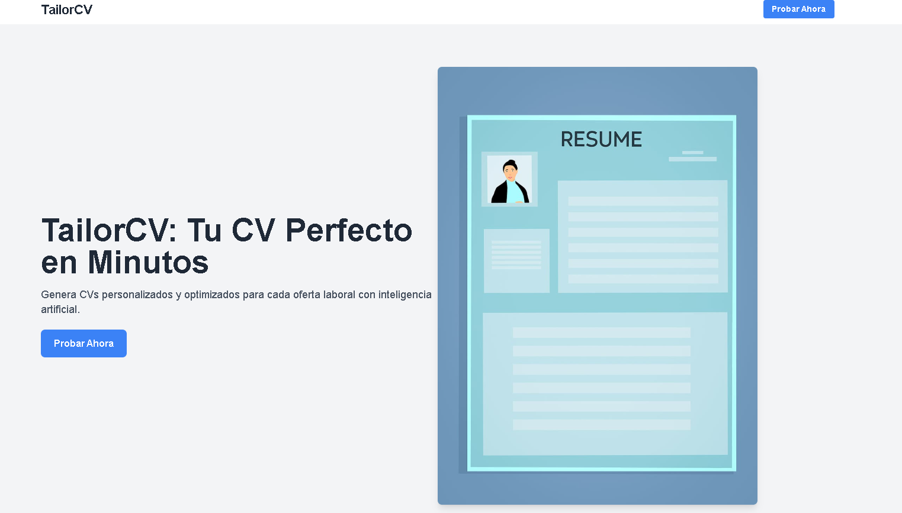
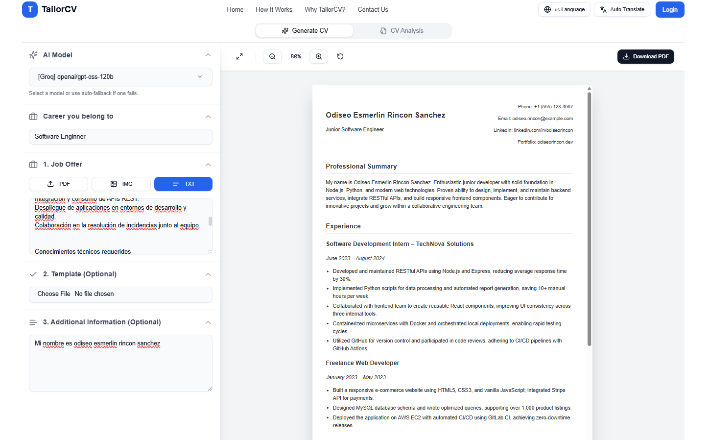
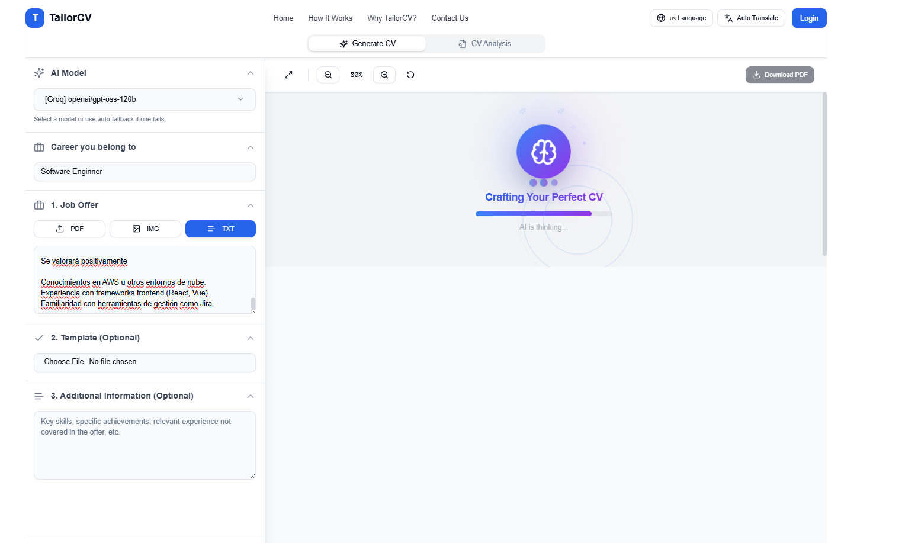
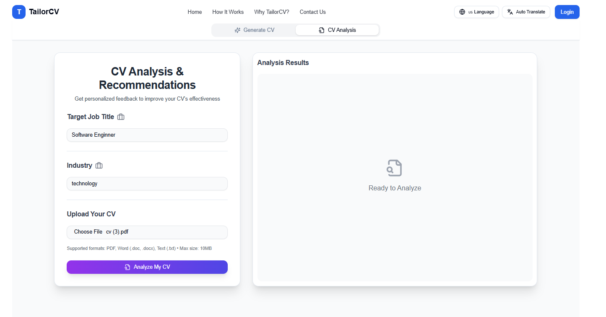
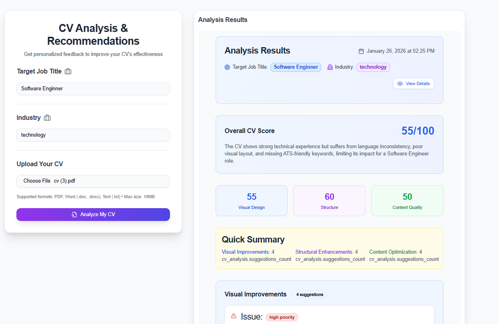
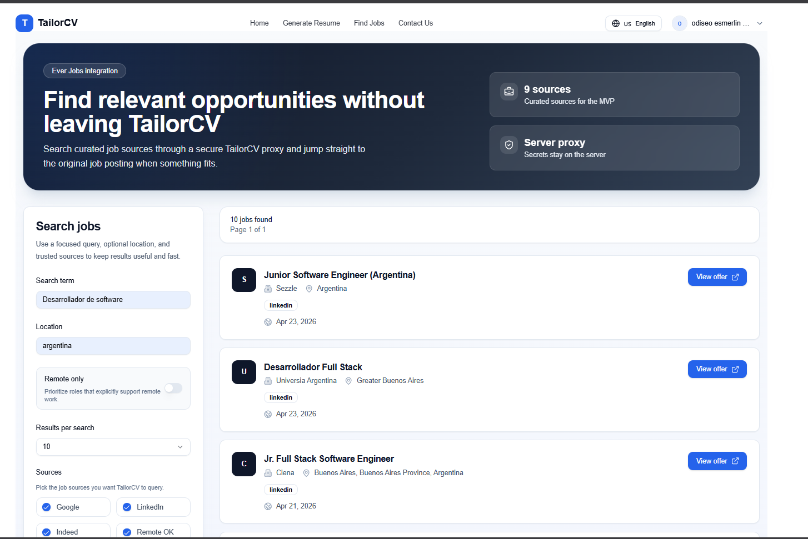

# Tailor CV

Tailor CV es una plataforma web para crear, optimizar y exportar curriculums con ayuda de IA, tomando como contexto una oferta laboral real y tu perfil profesional.



## Que es Tailor CV

El objetivo de Tailor CV es reducir el tiempo entre "encontrar una vacante" y "postular con un CV adaptado".

La aplicacion combina:
- Perfil profesional persistente (datos personales, experiencia, educacion, skills y redes).
- Generacion de CV asistida por IA con seleccion de modelo/proveedor.
- Analisis de CV con recomendaciones accionables.
- Sistema de suscripciones y metodos de pago con Stripe.
- Busqueda de empleo integrada mediante backend seguro (`/api/job-search`).

## Que puedes hacer en Tailor CV

### 1. Generar un CV personalizado con IA

En `/generar-cv` puedes:
- Cargar la oferta laboral como texto, PDF o imagen.
- Elegir proveedor/modelo de IA (OpenRouter, Groq, DeepSeek, OpenAI, Gemini).
- Adjuntar una plantilla PDF personalizada.
- Anadir contexto adicional (carrera, informacion extra).
- Ver vista previa multipagina A4.
- Editar manualmente el contenido generado antes de exportar.
- Exportar a PDF desde el backend (`/api/pdf-export`).




### 2. Analizar tu CV y recibir mejoras

En la misma seccion (`/generar-cv`, pestana de analisis) puedes subir tu CV y obtener:
- Puntuacion general.
- Evaluacion de estructura y calidad.
- Recomendaciones de mejora.
- Sugerencias orientadas a puesto e industria.




### 3. Gestionar tu perfil profesional

En `/profile` tienes un panel para:
- Informacion personal.
- Experiencia laboral.
- Educacion.
- Habilidades.
- Redes sociales.
- Preferencias de CV.

Esta informacion alimenta la generacion automatica del CV.

### 4. Buscar vacantes desde Tailor CV

En `/buscar-trabajo` puedes:
- Buscar por termino y ubicacion.
- Filtrar por sitios permitidos.
- Paginar resultados.
- Ir al enlace original de cada vacante.

El cliente nunca expone la API externa: la busqueda pasa por `/api/job-search` con validacion y saneamiento.



### 5. Planes, suscripciones y facturacion

Con Stripe integrado puedes:
- Consultar planes (`/api/stripe/plans`).
- Crear checkout de suscripcion (`/api/stripe/create-checkout-session`).
- Gestionar suscripcion (`/api/stripe/subscriptions`).
- Gestionar metodos de pago (`/api/stripe/payment-methods`).
- Procesar eventos webhook (`/api/stripe/webhook`).

## Arquitectura funcional

- Frontend: Next.js App Router + React + TypeScript + Tailwind.
- Backend: Route Handlers en `src/app/api/*`.
- Auth: NextAuth (credenciales + Google + LinkedIn).
- Base de datos: PostgreSQL con Prisma ORM.
- IA: enrutador con fallback entre multiples proveedores (`/api/ai`).
- Emails: Resend (`/api/email`).
- Archivos/plantillas: manejo en `public/templates` via `/api/templates`.

## Stack tecnico

- `next@15.3.8`
- `react@18`
- `typescript@5`
- `prisma@6`
- `next-auth@4`
- `stripe@18` + `@stripe/react-stripe-js`
- `zod`
- `zustand`
- `framer-motion`
- `i18next` (ES, EN, FR, ZH)

## Estructura principal del proyecto

```text
src/
  app/
    api/                  # Route Handlers (IA, Stripe, auth, perfil, jobs, etc.)
    generar-cv/           # Generador + analisis de CV
    buscar-trabajo/       # Buscador de vacantes
    profile/              # Panel de perfil
    components/           # UI de dominio
  lib/
    ever-jobs/            # Cliente, schemas y mappers de busqueda laboral
    puppeteer-pdf/        # Exportacion PDF del HTML generado
  stores/                 # Estado global (Zustand)
prisma/
  schema.prisma
  migrations/
public/
  locales/
  templates/
images/                   # Capturas para documentacion
```

## Instalacion y ejecucion local

### Requisitos

- Node.js 18+
- PostgreSQL
- Cuenta Stripe (si usaras pagos)
- Al menos una API key de proveedor IA

### Pasos

```bash
# 1) Instalar dependencias
npm install

# 2) Configurar variables
cp .env.example .env

# 3) Migrar base de datos
npx prisma migrate dev

# 4) (Opcional) seed de datos
npm run seed
node prisma/seed-subscriptions.js

# 5) Ejecutar en desarrollo
npm run dev
```

## Variables de entorno

### Base de datos y auth

```env
DATABASE_URL="postgresql://..."
NEXTAUTH_SECRET="..."
APP_URL="http://localhost:3000"
```

### OAuth (social login)

```env
GOOGLE_CLIENT_ID="..."
GOOGLE_CLIENT_SECRET="..."
LINKEDIN_CLIENT_ID="..."
LINKEDIN_CLIENT_SECRET="..."
```

### Proveedores IA

```env
OPENROUTER_API_KEY="..."
GROQ_API_KEY="..."
DEEPSEEK_API_KEY="..."
OPENAI_API_KEY="..."
GEMINI_API_KEY="..."
```

### Stripe

```env
STRIPE_SECRET_KEY="sk_..."
STRIPE_WEBHOOK_SECRET="whsec_..."
NEXT_PUBLIC_API_STRIPE_PUBLIC_KEY="pk_..."
```

### Jobs + email + PDF

```env
EVER_JOBS_API_URL="https://..."
EVER_JOBS_API_KEY="..."
EVER_JOBS_DEFAULT_COUNTRY="USA"
EVER_JOBS_DEFAULT_PAGE_SIZE="10"
EVER_JOBS_TIMEOUT_MS="45000"
EVER_JOBS_ALLOWED_SITES="google,indeed,remoteok,remotive,arbeitnow,weworkremotely,jobicy,himalayas,themuse"
RESEND_API_KEY="re_..."
CHROME_PATH="" # opcional, para exportacion PDF en servidores especificos
```

## Scripts disponibles

```bash
npm run dev      # Desarrollo
npm run build    # Prisma generate + build de Next
npm run start    # Produccion
npm run lint     # Lint
npm run seed     # Seed base
```

## Endpoints clave

- `POST /api/ai`: generacion y fallback de IA.
- `GET /api/ai-models`: listado dinamico de modelos por proveedor.
- `POST /api/job-search`: busqueda de empleo segura via backend.
- `GET|POST|DELETE /api/templates`: gestion de plantillas PDF.
- `POST /api/pdf-export`: exportacion de HTML a PDF.
- `POST /api/email`: envio de feedback por correo.
- `GET /api/stripe/plans`: planes disponibles.
- `POST /api/stripe/create-checkout-session`: checkout de suscripcion.
- `GET|PATCH|DELETE /api/stripe/subscriptions`: gestion de suscripcion.
- `GET|POST|DELETE /api/stripe/payment-methods`: gestion de tarjetas.

## Modelo de datos (Prisma)

Entidades principales:
- `User`
- `WorkExperience`
- `Education`
- `Skill`
- `SocialLink`
- `CvPreferences`
- `Subscription`
- `PaymentMethod`
- `SubscriptionPlan`

Relacion central: `User` conecta perfil, preferencias de CV y facturacion.

## Estado actual del proyecto

Tailor CV ya funciona como producto completo para:
- Crear CVs orientados a vacantes.
- Analizar CVs existentes.
- Gestionar perfil profesional.
- Buscar ofertas laborales.
- Monetizar con suscripciones.

Si quieres, el siguiente paso puede ser separar este README en:
- README para usuarios finales.
- README tecnico para desarrolladores.
